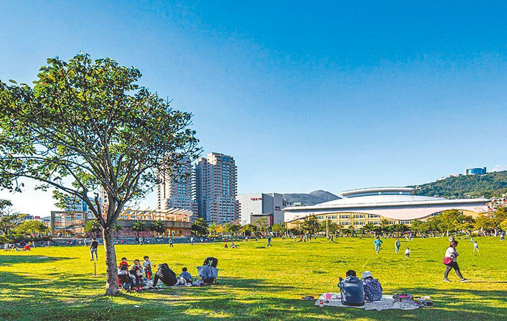

# 台北市士林區士東路120巷22弄4號1樓

### 當您
厭煩了台北市的髒空氣

厭煩了人聲鼎沸的超級大班

厭煩了作業還沒寫、考試還沒讀的晚歸心焦

厭煩了想問問題卻沒老師、想自修卻沒教室

厭煩了機械呆版的老師，單向的填鴨教育

### 那麼
請來試試漫步在天母、輕輕鬆鬆地上課，精彩的上課內容，雙向幽默的教學，每週的小考與作業，勤管嚴教。

明亮舒適的自修教室，溫馨的一對一課輔，高額的數學獎學金，加上輔導老師無遠弗屆的關懷，讓您在愛的氛圍中，不知不覺擁有傲人成績。

.

選擇拓璞：

### 🌳 心無旁騖的學習環境
遠離城市喧囂，讓專注與效率全面提升。

### 🌟 受人景仰之名師 
國英數物化各科老師教學經驗皆超過25年，於全國補教界王牌赫赫有名，倍受業界肯定。

### 🌟 平易近人的班主任
不以威嚴管教課業，以尊重賢才和推己及人態度看待每一位學生。

### 🌏 全球視野與本地關懷
天母國際化特質，開拓孩子的眼界與格局。

---
## 讀書，原來也可以如此優雅
搖曳在忠誠路落英繽紛的欒樹，處處顯示天母的風懷迷人。我們在大葉高島屋前、蘭雅公園旁最佳地段，以最舒適的空間、完善的設備，開了最精緻的天母小班。

