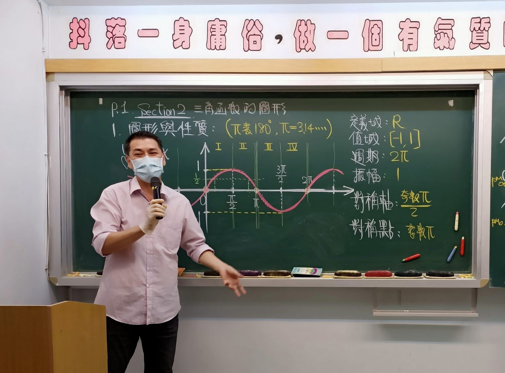
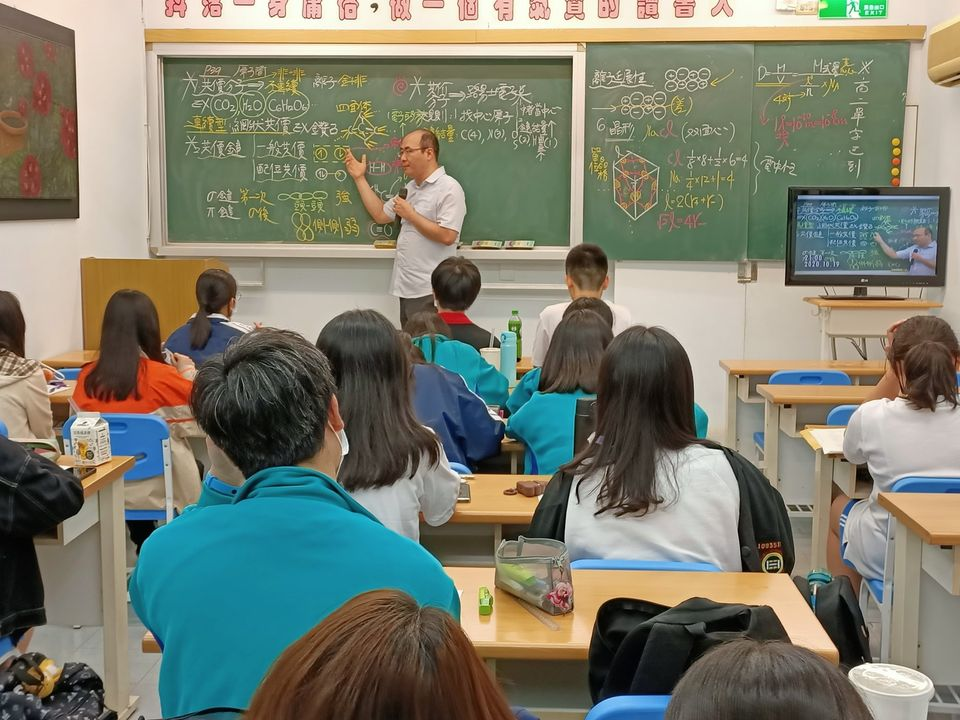

# 數學__賴和老師
### 大學時期即任教於南陽街補習班 業界公認最強
- 輔大博士班
- 台大法律、台大數學雙修
- 三立、中天、八大、年代、台視、中視等各大電視台爭相採訪 
- 風趣幽默、條理清晰
- 課前課後一律親自解答，不限時，經常超過晚上十二點
- 已訓練出建中、麗山、大同、中正、內湖、陽明、復興等校全校數學最高分
 

高二數段考試題檢討
<iframe width="560" height="315"
    src="https://www.youtube.com/embed/VcBPR1B_ARE"
    frameborder="0"
    allowfullscreen>
</iframe>

.
# 英文__夏耘哲老師
### 入圍大考中心六年 掌握命題趨勢 教學方向最精準
- 美國UC Berkeley英文教學正科畢業，博士班候選
- 命中97、101、103、107年指考及104、105、108年學測作文
- 英文作文為最強項，純正美式寫法拿不到低分
- 美國柏克萊高中教師、美加托福、GRE、TOEIC、重考班名師
- 應教育部邀約至台北、台中各高中示範英語教學
 

.
# 國文__郭懿國文
### 君子博學而日參省己，則知明而行無過矣
- 教育局教育實習績優獎、實習楷模獎  
- 將國文加深加廣，貼合大考跨領域，素養化趨勢
- 儒林全台分部、得勝者、文成、陳立等各大班係、龍騰elevo線上名師
- 台灣師範大學國文研究所畢業

 

國文 小說流變
<iframe width="560" height="315"
    src="https://www.youtube.com/embed/2wAOGXEUH78?si=t9PJus_bZb05-G3U"
    frameborder="0"
    allowfullscreen>
</iframe>

.
# 物理__林冠傑老師
### 不教簡單物理 只把物理教到簡單
- 建中、清大物理研究所畢業
- 全國兩大網路教學STUDYBANK首席線上教學物理名師
- 北車林冠傑高中物理家教班 創辦人
- 台北南陽街、高雄站前、台中水利大樓大班物理名師，每班人數皆超過200人
- 善於引導思路，觀念講解清晰
- 已教出五屆全國醫科總榜首及建中北一全校物理最高分
- TVBS、中天、年代、聯合報考前專訪
- 著作等身，各大書局爭相邀約出版物裡參考書52本
 

高二物理簡諧運動
<iframe width="560" height="315"
    src="https://www.youtube.com/embed/5CfS6V1oEms"
    frameborder="0"
    allowfullscreen>
</iframe>

.
# 化學__黃震老師
### 台大化學研究所碩士 學生深藍網站評價第一
- 南一中、台大化學研究所碩士
- 北一建中生最愛，建中資優班吳沅達大力推薦，並帶領同學一同報名，現為醫科生
- 口碑遠播，許多外縣市慕名者(新竹、楊梅、台中)
- 締造驚人成績 : 段考每四人即有一位班上前二名
- 已訓練出成功、麗山、大直、中正、內湖、復興等校全校數學最高分
 

高二化學 反應速率
<iframe width="560" height="315"
    src="https://www.youtube.com/embed/7Qv0uSBGnfU"
    frameborder="0"
    allowfullscreen>
</iframe>

---
備註：
- 周一到周日皆開放冷氣地板自習教室。
- 周一到周六皆有強英數理化課程，免費一對一老師解題輔導。
