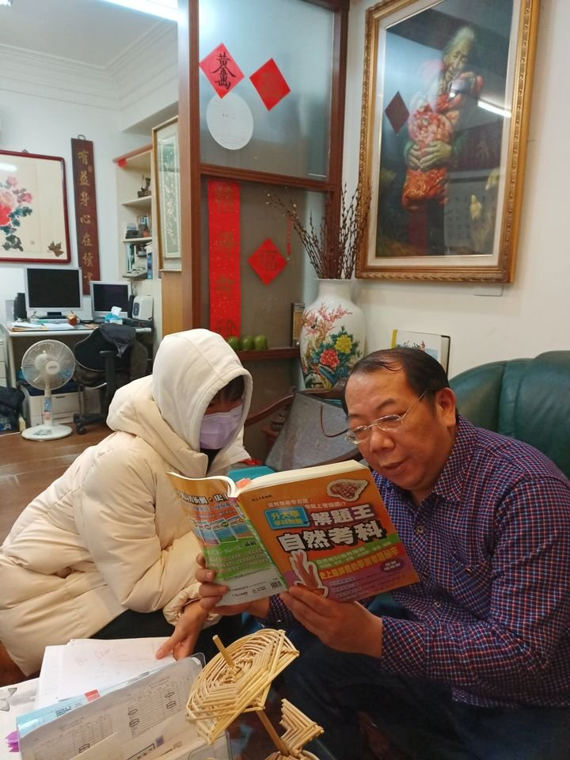

# 數學__賴和老師
### 大學時期即任教於南陽街補習班 業界公認最強
- 台大法律、台大數學雙修
- 三立、中天、八大、年代、台視、中視等各大電視台爭相採訪 
- 風趣幽默、條理清晰
- 課前課後一律親自解答，不限時，經常超過晚上十二點
 

.
# 英文__夏耘哲老師
### 入圍大考中心六年 教學方向精準
- 命中97、101、103、107年指考及104、105、108年學測作文
- 英文作文為最強項，純正美式寫法拿不到低分
- 美國柏克萊高中教師、美加托福、GRE、TOEIC、重考班名師
- 應教育部邀約至台北、台中各高中示範英語教學
 

. 
# 國文__郭懿國文
### 君子博學而日參省己，則知明而行無過矣
- 教育局教育實習績優獎、實習楷模獎  
- 將國文加深加廣，貼合大考跨領域，素養化趨勢
- 儒林全台分部、得勝者、文成、陳立、龍騰elevo線上
- 台灣師範大學國文系

 

.
# 物理__林冠傑老師
### 不教簡單物理 只把物理教到簡單
- 全國兩大網路教學STUDYBANK首席物理名師
- 林冠傑高中物理家教班 創辦人
- 台北南陽街、高雄站前、台中水利大樓大班物理名師，每班人數皆超過200人
- 善於引導思路，觀念講解清晰
 

.
# 化學__黃震老師
### 台大化學研究所碩士 學生深藍網站評價第一
- 台大化學研究所碩士
- 建中資優班吳沅達大力推薦，並帶領同學一同報名，現為醫科生
- 口碑遠播，許多外縣市慕名者(新竹、楊梅、台中)
- 締造驚人成績 : 段考每四人即有一位班上前二名
 

---
備註：
- 周一到周日皆開放冷氣地板自習教室。
- 周一到周六皆有強英數理化課程，免費一對一老師解題輔導。
